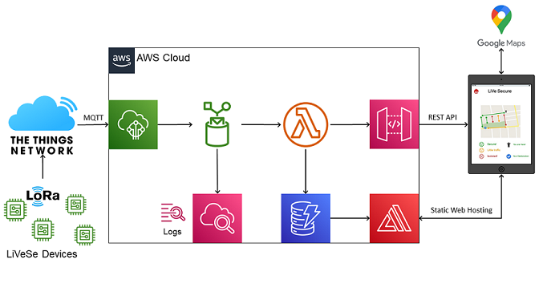

# Cloud Integration

The thing network, Amazon Wes Services and Google Maps API defines all the cloud Integration with our project, these are the single modules we adopted



- the Thing network Console 
- the Thing Network MQTT Broker to AWS IoT Core
- AWS IoT Core Rule Engine
- AWS Lambda Function
- AWS CloudWatch
- AWS DynamoDB
- AWS API Gateway
- AWS Amplify
- Google Maps API

Firstly, Uplink messages from the end Devices reach the Lora gateway in TTN. Here they are forwarded to AWS IOT Core module through the MQTT broker. Once They are forwarded messages are stored inside AWS CloudWatch for logs and then modulated by AWS IoT Rule Engine in order to fit inside a table of the AWS DynamoDB;In particular we decided to treat the device-ID as the name of the Road/square where the device is located. Instead, the payload of the messages `frm_payload` bring the current state computed by the end device inside the AWS Environment as statusB64. Device EUI and time-stamp of the message are also extrapolated from the uplink message.

```sql
-- SQL query over TTN uplink message
SELECT end_device_ids.dev_eui as device_eui, end_device_ids.device_id as street, uplink_message.frm_payload as statusB64, received_at as time 
FROM 'lorawan/+/uplink'
```
Once the message is received by the IoT Core it's passed to a Lambda Function **[Decode64_update.py](/AWSlambdaFx/Decode64_update.py)**. Where `statusB64` is converted from Base64 to string before being insert inside the Database.

AWS Dynamo Database is composed by a single table `LiVeSeDB(devEUI,street,last_status,lat,long,status,timestamp)`

*devEUI* is the primary key of the table and street is the sorting key. Using these 2 keys every message is identified by its device and then inserted inside the DB; Information stored are then accessed by another Lambda function **[get_table.py](/AWSlambdaFx/get_table.py)** that expose all the table over an https-REST endpoint, acting as a public API :**[LiVeSeDB API endpoint](https://42lal2bea7b5ufnq42umzkhxxy0zuhki.lambda-url.eu-west-1.on.aws/)**.
Finally, AWS Amplify module hosts a web dashboard where information from end devices are merged and visualized using the Google Maps APIs.

-- how works dashboard --

The dashboard is available **[here]()**

