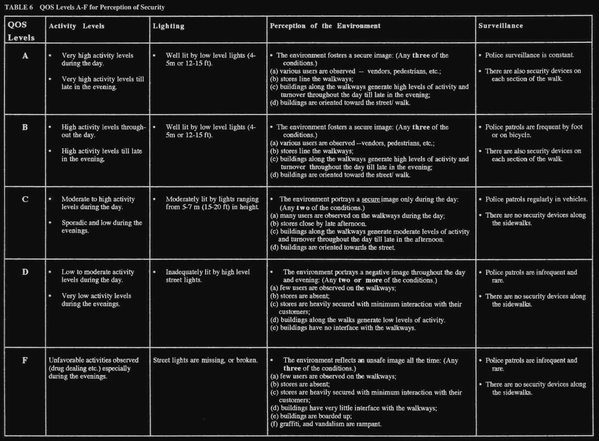

# The Problem and our Assumption

Taking into account the increase of violent cases, walking at night can make us feel **uncomfortable** and Public administration is not always aware of the **degradation** of neighborhoods

| General Crimes | 

Starting from that we tried to understand what could be done to enforce a higher feel of security in our cities 

we started from a simple question :

> *Can we measure **safety** of urban areas through **ambient sensors** and density of points of interest in that area?* 

We looked for **feedback** by opening an online Survey and these are the Results: 
*** 
*The Question was : Overnight before moving on an area, road or square, do you feel more secure passing through...*

| Light Graph | Noise Graph |
|--------|--------|
|    |    |

| Crowd Graph |
|--------|
||

To further validate our claims, we searched on internet for Papers that relates **perception of safety** with the environment and there is what we found : 

> 
> [Evaluation of safety for Pedestrians at Macro- and Micro-levels in Urban Areas](https://onlinepubs.trb.org/Onlinepubs/trr/1995/1502/1502-012.pdf)

The results of the various surveys and research led us to change some elements of our design taking us to a very simple and affordable solution, which is to create a system that is based on the aspects that emerged during the collection of data.
This bring us to affirm that : 
`More People, light and crowd in the street implies more secure areas`

# Concept

*`LiVeSe` is a smart security system. Through distributed stations acquires, during night-time, environment information like noise, light level and movement*

*`LiVeSe` tries to extrapolate the amount of crowd and the brightness of the street then evaluate perceived safety of the urban area based on that parameters*

*`LiVeSe` allow us to visualize the state of our streets in terms of expected safety and improve perceived safety of our cities along with integrating Google maps navigation system*

Indeed, we decide to exploit the benefits of IoT devices as *pervasive systems* to collect data from streets and squares, evaluate safety with our algorithm, and visualize our results with the help of Cloud Services. 

This is our mockup that shows our idea for the final User experience:

# Personas 

##  Lisa

>Lisa is a waitress who finishes late for work and wants to get home safely. She always comes home from the same path. Unfortunately one day the road is blocked and Lisa is obliged to change her path. Lisa would feel safer if she had the chance to find an alternative and safe route. This can be achieve by inspecting our application and see what is the status of the street in order to choose the correct path to come back to her house in the best way as possible.

## Marco

>Marco is a district public administrator of Rome, working in the branch of urban regeneration. Through our system he is able to understand which areas need more focus and attention than others. So Marco's decision is to allocate new resources and services in order to rehabilitate certain areas that require work.

## Storyboard

- *A client wants to walk in an urban area* 
- *He wants to be sure if it's secure before passing through*
- *He connects to the designed app and receive information about that area*
- *The system provides a suggested path, the most secure possible* 
- *The system voluntarily avoids unsecured roads or squares*
- *The client can choose the path that he prefeer*
- *The client reach the final destination*

> Link to Second delivery [Concept](../2nddelivery/concept2.md)
