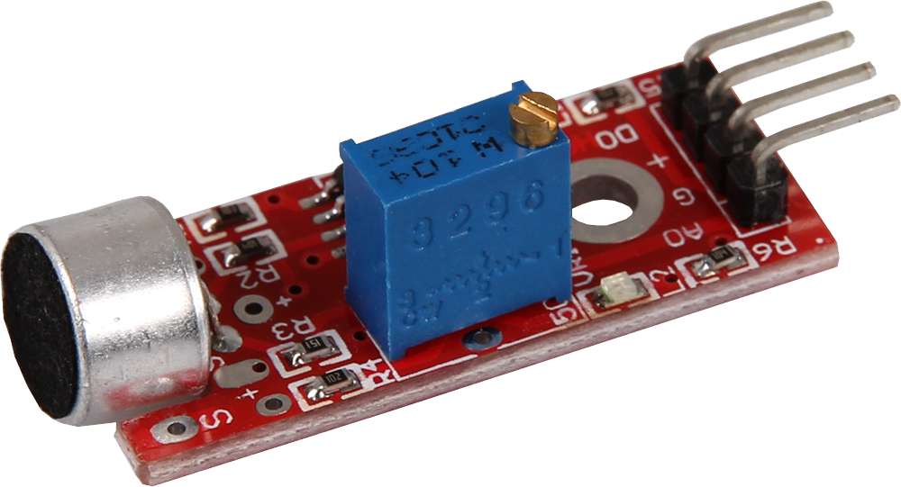
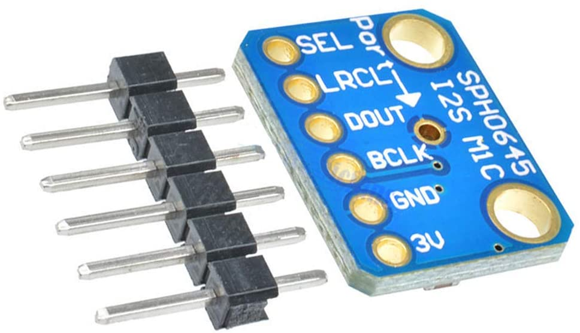

## Energy consumption 

| **Products** | **Power Consume** | **Power Consume on StandBy** | 
| :---: | :---: | :---: | 
| `Nucleo -f401re` | 146µA | 2.4µA | 
| `Pir HC-SR501` | ~1 mA while motion is detected | ~40-60µA | 
| `Mic KY-037` | ~1 mA | ~0 µA | 
| `Photoresistor like GL5516` | ~0 µA |  ~0 µA | 

We try to gain a more efficient measurement about power energy with a specific tool like ammeter. We put two boards on series and evaluate what's the power consumption of the board. The output of our ammeter says that we consume *0,004A = ~4mA*. The main problem about this measure is that our ammeters give this results only if it's on a large scale of unit and so we think that it's broken.

```
66000mAh Battery Capacity (3xAAA)
~4mA      Max Consumption
==
1650h Max Battery Life

expected ~10h of Duty time every day
```

|sleep-active cycle (sec)  |active time every h | active hours 1 day | Expected Battery Life |
|--|--|--|--|
|0-60 |60m|10h | 68 days |
|2-4|40m|6.6h | 250 days |
|4-2|20m|3.3h | 500 days |

So in order to estimate the value of our total energy consumption, we try to obtain the data sheet of our all component but not all components are available.

- The main constraint is energy consumption: We want the battery to last for at least one year.

However, Our initial approach is **Oversampling** : we don't know yet what is the *best sampling rate*

- We need more testing on *real scenarios* in order to understand how dynamic can be our phenomena. We will try to decrease Active time as much as possible for the next delivery

For now, we decide to read from each device every 2 seconds, and the board go to sleep mode for 4 seconds.

We Tried to experiment with FIT IOT lab and the average consumption was of *0.018A = ~18mA* as shown :


under the same cycle (2-4):
```
66000mAh Battery Capacity (3xAAA)
~18mA      Max Consumption
==
366.4h Max Battery Life (6 days)
expected ~10h of Duty time every day
6.6h of active hours every day
==
50 days Expected Battery Life
```
|sleep-active cycle (sec)  |active time every h | active hours 1 day | Expected Battery Life |
|--|--|--|--|
|2-4|40m|6.6h|50 days|

## Sampling Frequency analysis

To compute our **environmental variable** we tried different approaches:
- Constant Sampling 
  - In this case obviously we got the more accurate results but our lifetime cycle goes down to a few weeks
- Defined Sampling time
  - To do this we studied some real life cases: how much time a person need to pass through a distance of 20 meters?(the distance that our PIR can cover at a given distance with an angle of 110 degree) so we switched to a Sampling time of 7 seconds, constant, alternating 7 seconds of sleep and some milliseconds of running mode for the whole night

Clearly the power consumption was much better but not enough again

- Variable Sampling Time(NO ML):
  - At this point we figured out that the variables that we measure don't change rapidly,so,why sample every 7 seconds without any reason?

There are a lot of possible ways here,and we are still triying some of them to understand what fit better for our purpose.

***
### PIR 
The approaches that we tested more and seems more interesting are two:
- Pir Counter
  - In this approach the PIR Scan every 10 seconds to be accurate but in this case if he detects someone his thread initialize a counter that will stop the scanning time:
    - this because we **DONT WANT TO COUNT HOW MANY PEOPLE passing through but we want to measure IF A SPECIFIC ROAD IS CROWDED OR NOT,** in principle we chosed the wrong approach cause of the accuracy of the testing,we don’t expect to detect all of the person,but THE TIME THAT “intercor” BETWEEN THE TWO EVENTS!


Same principle for the photoresistor,a defined sampling rate doesn’t fit at all in this project,in this case we got the best results storing in a Variable the last value read,if them match the sampling rate become higher,obviusly with a maximum critical value.

At this point it’s really important specify that we explicity decided to avoid do ML because it need to add another layer on our networking,this only to do Federeting ML.

- RoadHistorySampling:
  - In this scenario we increment the sampling time based on the results given by the whole ambient scan.

This works very well with light and noise,because of the semi-costant intrinsic nature of them,for the PIR it works very bad,in the worst case scenario is possible to don’t detect for a whole night cause of the sampling rate even lower.

***

We are still developing the one that in our idea is the best one,add a “bidirectional channel” using LoraWan,in this case we will be able to compute on the cloud,even with ML that obviusly performs better than a simple local logic AND allow us to develop a brand new feature,adapt the sampling rate on specific days,e.g. 1st of January,and even specific period,e.g. Covid-19 pandemic “”COPRIFUOCO”” and as a possibility,restart the board using Lora,generate Interrupt and a lot more.

We plan to add some of this features for the next time,we can anticipate now that we are now able to provide energy to the board using a new system,combining rechargeble batterys with a solar panel ,that will provide current to them using a circuit that respect the C/10 rule to preserv the battery.
As a spoiler at this point the life cycle doesn’t depends ho more only on the consumption of the board because we are able to generate and provide a lot of current,but depends primarly on the phisycal duration of the batteries,so,at the least 10 years,in the worst case.


## Accuracy of the PIR component

The measure of how many people will pass through streets is taken by the PIR. Its accuracy can be an issue since the sensor will keep the data every 2 second. 
As a consequence it could happen that the PIR can't detect effectively if a person pass or not in front of our station position.

So in order to avoid this problem, in the future we want to apply a servo-motor\stepper-motor to improve the gradation of the angle that the PIR occupies.
Taking into account that could probably have a greater impact in terms of consumption.

## Microphone quality
> KY-037 microphone 
> 

We tried to use this sensor in order to gain a good sample of sound in the surrounding. However, this sensor seems to be made from low quality components: even if it is considered as a sensor module with 'high sensitivity' it is not able to perceive sounds or noise farther than a few centimeters 

> SPH04645 I2S Mic
> 


......

##

> Link to second delivery [Evaluation](../2nddelivery/evaluation2.md)
