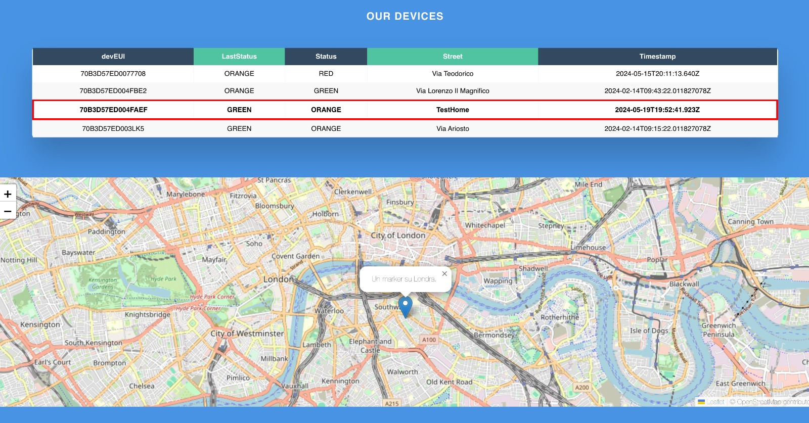

# Evaluation

## Requirements: 

> - The duration of the device during the night.
> - The accuracy of the pir should be very high.
> - The system must be energy independent for at least a year.
> - The system must be an optimal sample frequency.

## Energy consumption 

| **Products** | **Power Consume** | **Power Consume on StandBy** | 
| :---: | :---: | :---: | 
| `Nucleo -f401re` | 146µA | 2.4µA | 
| `Pir HC-SR501` | ~1 mA while motion is detected | ~40-60µA | 
| `Mic KY-037` | ~1 mA | ~0 µA | 
| `Photoresistor like GL5516` | ~0 µA |  ~0 µA | 

The major constraint that we have is energy consumption.
We try to gain a more efficient measurement about power energy with a specific tool like ammeter. We put two boards on series and evaluate what's the power consumption of the board. The output of our ammeter says that we consume *0,004A = ~4mA*. The main problem about this measure is that our ammeters give this results only if it's on a large scale of unit without fusibile.

```
66000mAh Battery Capacity (3xAAA)
~4mA      Max Consumption
==
1650h Max Battery Life

expected ~10h of Duty time every day
```

|sleep-active cycle (sec)  |active time every h | active hours 1 day | Expected Battery Life |
|--|--|--|--|
|0-60 |60m|10h | 68 days |
|2-4|40m|6.6h | 250 days |
|4-2|20m|3.3h | 500 days |

So in order to estimate the value of our total energy consumption, we try to obtain the data sheet of our all component.

Dissatisfied with the result we tried to experiment with FIT IOT lab and the average consumption was of *0.018A = ~18mA* as shown :


under the same cycle (2 sleep mode off - 4sleep mode on):
```
66000mAh Battery Capacity (3xAAA)
~18mA      Max Consumption
==
366.4h Max Battery Life (6 days)
expected ~10h of Duty time every day
6.6h of active hours every day
==
50 days Expected Battery Life
```
|sleep-active cycle (sec)  |active time every h | active hours 1 day | Expected Battery Life |
|--|--|--|--|
|2-4|40m|6.6h|50 days|

The first things that we think to improve the battery life, is to use a free energy.

## Solar Panel for Battery!

In the end we expect to have a consumption of about ~4mA, so for us it isn't a very problem the battery. But the main drawback of battery operated device is that it will be depleted after a certain time. This drawback can be eliminated by using natural resources like solar, wind or hydro energy. The most free source of energy to recharge the battery is solar energy. It is a relatively simple and cheap.

So we need to undestand first the type of battery, the common battery device are NiMH and Li-Ion.
The first facts to understand for battery charging is the thumb rule of 1/10th (commonly know as C/10). That means to charge the battery pack at 1/10th its rated current requires 16 hours of charge time. 

#### C/10 Rule 
Is a simple rule, for example if we have a 2xAA-sized 1300mAh battery pack 1.2V per cell, with cells in series, our pack outputs is 2.4V and 1300mAh. 
So we need to do this simple calculation :  
- C = 1300mAh
- C/10 = 130mAh
So to charge the above battery pack we need a higher voltage (2.4 to 3V) with a maximum current of 130mAh. In this example we need 16 hours to fully charge the battery pack. 

If we increase the current along the current from C/10 don't worry we will reduced only the life of battery.

#### Choose of solar panel
The main source for powering the sensor module is a solar panel. So it must be able to provide current for powering the board as well as current to charge the battery pack during the day. To choose the correct voltage of the panel we need to follow two simple tricks: 

> 1. Voltage : Choose 1.5 times the battery pack voltage (it is not an obligation it is only a recommendation)

> 2. Current : must be the current taken by the board plus the current for charging.

If we follow this simple tricks, in our case we use four battery AA (1.2 cad.) in series, that means we have 4.8V and the required voltage for solar panel is : 4.8 * 1.5 = ~7.2V. The quantity of the current that the solar panel must generate it will be the current cost of the board ( previusly estimated to 4mA and the current used in order to charge the battery : 2000mAh : C/10 Rule => 200mAh.

#### Choose the type of battery 
As we say before, this is a little problem, but don't worry we can use the same circuit in order to recharge same NiMh and Li-Ion battery. The problem stand only for the Li-Ion batterys :
> You must take certain precautions when dealing with Lithium Ion Batteries. In order to maintain a very precise voltage when charging. For example the 4.8V batteries we're using need to have a charging volta of 7.2V. A volt high or a volt low can mean an out of control chemical reaction, which can lead to danger!

To resolve this problem u can use the Lithium Battery Charging Board that has the recharge protection. There are a lot of type of Lithium Battery Chargin Board, all turns off when finished to recharge the battery. The integrated protection circuit protects against overvoltage and polarity reversal. For that is important the wiring connection.

So to avoid this lot of problem with Li-Ion battery we use the Ni-MH.

Another way to improve the battery is to upgrade the sampling rate.

## Sampling Frequency analysis

To compute our **environmental variable** we tried different approaches:
- Constant Sampling 
- -  In this case obviously we got the more accurate results but our lifetime cycle goes down to a few weeks, and the battery goes down very fast!
- Defined Sampling time
- - To do this we studied some real life cases: how much time a person need to pass through a distance of 20 meters?(the distance that our PIR can cover at a given distance with an angle of 110 degree) so we switched to a Sampling time of 7 seconds, constant, alternating 7 seconds of sleep and some milliseconds of running mode for the whole night. Clearly the power consumption was much better but not enough again
- Variable Sampling Time(No ML):
- - At this point we figured out that the variables that we measure don't change rapidly,so,why sample every 7 seconds without any reason? There are a lot of possible ways here,and we are still triying some of them to understand what fit better for our purpose.

### PIR 
The approaches that we tested more and seems more interesting are two:
- Pir Counter
- - In this approach the PIR Scan every 10 seconds to be accurate but in this case if he detects someone his thread initialize a counter that will stop the scanning time: this because we **DONT WANT TO COUNT HOW MANY PEOPLE passing through but we want to measure IF A SPECIFIC ROAD IS CROWDED OR NOT,** in principle we chosed the wrong approach cause of the accuracy of the testing,we don’t expect to detect all of the person,but THE TIME THAT “intercor” BETWEEN THE TWO EVENTS! 
Same principle for the photoresistor,a defined sampling rate doesn’t fit at all in this project,in this case we got the best results storing in a Variable the last value read,if them match the sampling rate become higher,obviusly with a maximum critical value.
At this point it’s really important specify that we explicity decided to avoid do ML because it need to add another layer on our networking,this only to do Federeting ML.
- RoadHistorySampling:
- - In this scenario we increment the sampling time based on the results given by the whole ambient scan. This works very well with light and noise,because of the semi-costant intrinsic nature of them,for the PIR it works very bad,in the worst case scenario is possible to don’t detect for a whole night cause of the sampling rate even lower.

## Network Usage

This architecture does not have any particular network constraint, because we planned to send data to the cloud only when the "SECURITY" level changes. And even if the security level changes, our board will send only a simple value that stand for : red - yellow - green. However, we must take into account that a lot of devices can send the value but should be supported by the gateway infrastructure.

### Packets and Payload Size 

Taking into account our implementation, we sent a LoRa message with a payload of 3byte. Considering that a normal LoRa packet use 13 bytes as header, we have 16bytes of the toal packet size. Using the calculator provided by The Things Network we obtained that the Time on Air of a packet is 51.5 ms. 
We should improve better the Time on Air of the packet, considering to send only a LoRa message with a payload of 1byte. 


## Future improvements

We are still developing the one that in our idea is the best one,add a “bidirectional channel” using LoraWan,in this case we will be able to compute on the cloud,even with ML that obviusly performs better than a simple local logic AND allow us to develop a brand new feature,adapt the sampling rate on specific days,e.g. 1st of January,and even specific period,e.g. Covid-19 pandemic “”COPRIFUOCO”” and as a possibility,restart the board using Lora,generate Interrupt and a lot more.

The `dashboard` is under development as u can see there, we managed to integrate the google api.


The last important improvements it's the `mic sensor`. In our system we use the KY-037, but with this components we have a huge problems. This mic can listen only BIG CHANGE of volume, and for our purposes it is not so useful, because we should be able to "detect" the sound of the human voice. We tried replacing the microphone with "SPH04645 I2S Mic " but in this case is very hard to handle this component with the riot documentation. We still try it but it requires a lot of time.

The measure of how many people will pass through streets is taken by the `PIR`. Its accuracy can be an issue since the sensor will keep the data every 2 second.  As a consequence it could happen that the PIR can't detect effectively if a person pass or not in front of our station position.
So in order to avoid this problem, in the future we want to apply a servo-motor\stepper-motor to improve the gradation of the angle that the PIR occupies. Or maybe we could put more PIRS arranged sequentially but the problem goes to the wiring. 

##

> Link to second delivery [Evaluation](../2nddelivery/evaluation2.md)
